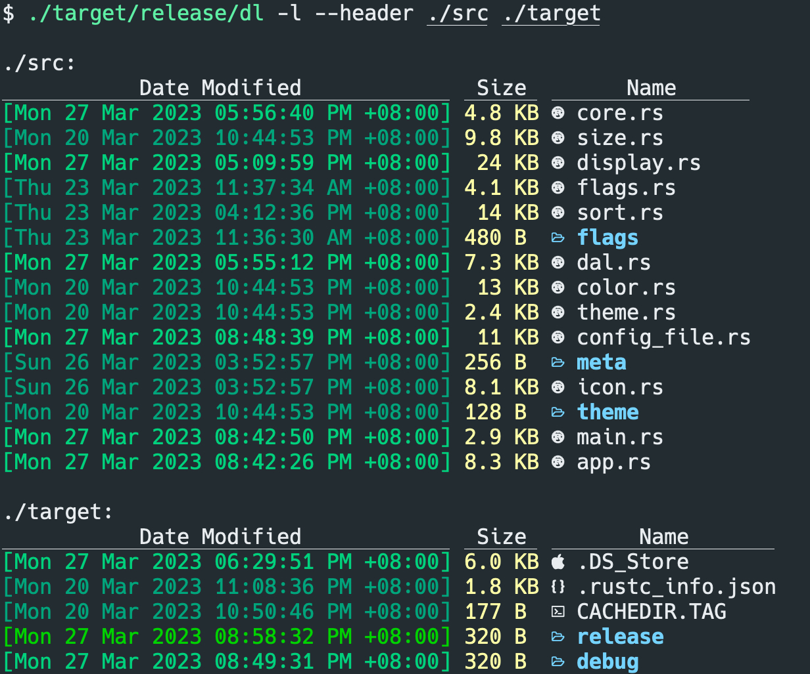

# DiLu

[](https://raw.githubusercontent.com/zwpaper/dilu/master/LICENSE)

Dilu is a powerful, colorful, iconic command line tool leveraging the power of [Apache OpenDAL™](https://github.com/apache/incubator-opendal), easily access `FileSystem`, `S3`, `HDFS`, `Redis`, etc.



## Configuration

Dilu can use configuration files to change it's behavior,
including `display`, `color theme` and `icon theme`.

### Display Configuration

The default Display configuration is specified below,
with comment for how it can be used.

```yaml
# == Classic ==
# This is a shorthand to override some of the options to be backwards compatible
# with `ls`. It affects the "color"->"when", "sorting"->"dir-grouping", "date"
# and "icons"->"when" options.
# Possible values: false, true
classic: false

# == Blocks ==
# This specifies the columns and their order when using the long and the tree
# layout.
# Possible values: permission, user, group, context, size, date, name, inode
blocks:
  - date
  - size
  - name

# == Color ==
# This has various color options. (Will be expanded in the future.)
color:
  # When to colorize the output.
  # When "classic" is set, this is set to "never".
  # Possible values: never, auto, always
  when: auto
  # How to colorize the output.
  # When "classic" is set, this is set to "no-color".
  # Possible values: default, no-color, no-lscolors, <theme-file-name>
  # when specifying <theme-file-name>, dilu will look up theme file in
  # XDG Base Directory if relative
  # The file path if absolute
  theme: default

# == Date ==
# This specifies the date format for the date column. The freeform format
# accepts an strftime like string.
# When "classic" is set, this is set to "date".
# Possible values: date, relative, +<date_format>
# date: date

# == Display ==
# What items to display. Do not specify this for the default behavior.
# Possible values: all, almost-all, directory-only
# display: all

# == Icons ==
icons:
  # When to use icons.
  # When "classic" is set, this is set to "never".
  # Possible values: always, auto, never
  when: auto
  # Which icon theme to use.
  # Possible values: fancy, unicode
  theme: fancy
  # The string between the icons and the name.
  # Possible values: any string (eg: " |")
  separator: " "

# == Ignore Globs ==
# A list of globs to ignore when listing.
# ignore-globs:
#   - .git

# == Layout ==
# Which layout to use. "oneline" might be a bit confusing here and should be
# called "one-per-line". It might be changed in the future.
# Possible values: grid, tree, oneline
layout: grid

# == Recursion ==
recursion:
  # Whether to enable recursion.
  # Possible values: false, true
  enabled: false
  # How deep the recursion should go. This has to be a positive integer. Leave
  # it unspecified for (virtually) infinite.
  # depth: 3

# == Size ==
# Specifies the format of the size column.
# Possible values: default, short, bytes
size: default

# == Sorting ==
sorting:
  # Specify what to sort by.
  # Possible values: extension, name, time, size, version
  column: name
  # Whether to reverse the sorting.
  # Possible values: false, true
  reverse: false
  # Whether to group directories together and where.
  # When "classic" is set, this is set to "none".
  # Possible values: first, last, none
  dir-grouping: none

# == Total size ==
# Whether to display the total size of directories.
# Possible values: false, true
total-size: false

# == Hyperlink ==
# Whether to display the total size of directories.
# Possible values: always, auto, never
hyperlink: never
```


## Credits

The origin version of this project is rewrote from [LSD](https://github.com/lsd-rs/lsd),
thanks so much to [@meain](https://github.com/meain) and [@Peltoche](https://github.com/Peltoche)
for developing and maintaining LSD.

Dilu is NOT a replacement for LSD, Dilu will focus more on network data accessing, multiple backend support,
while LSD will offer much more functions and accessibility on local file system.

The data accessibility is leveraging the power of [Apache OpenDAL](https://github.com/apache/incubator-opendal),
thanks so much to [@Xuanwo](https://github.com/Xuanwo) for developing and open-sourcing OpenDAL.
